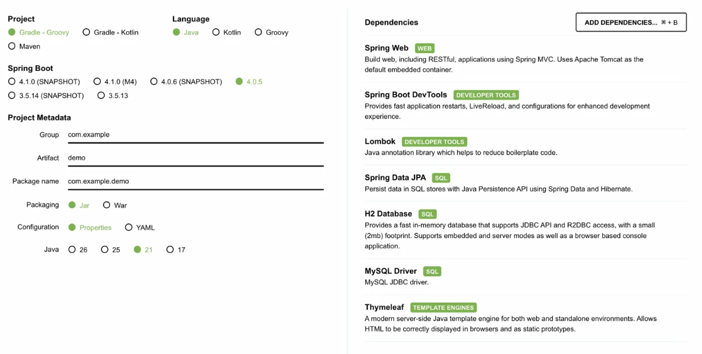

# 1회차 Java for Spring


# 📘 Today I Learned


# 1. Framework

## 1.1 정의

`Frame(틀, 규칙) + Work(일, 소프트웨어의 목적)`

→ "프로그램이 돌아가기 위해 반복적으로 필요한 지루한 작업들"을 미리 다 짜놓은 거대한 약속  
→ 개발자는 그 틀 안에서 "내가 실제로 만들고 싶은 것"에만 집중하면 됨

---

## 1.2 왜 사용하는가

**문제 상황**

- 서비스 하나 만들려면, 실제 기능보다 그걸 돌아가게 하는 인프라 코드가 훨씬 많아짐
- 로그인 하나 만들겠다고 HTTP 연결 → DB 연결 → 예외 처리까지 매번 처음부터 짜야 함

**해결 방식**

- Framework가 "이런 상황엔 이 구조로 해"라는 규칙 + 공통 작업을 미리 구현해서 제공
- 개발자는 규칙대로만 코드 작성 → 나머지는 Framework가 알아서 처리

---

# 2. Spring

## 2.1 정의

→ Java 기반 애플리케이션 개발을 위한 Framework  


---

## 2.2 등장 배경

- EJB : Spring 이전 Java의 표준 Framework
- EJB에 종속적인 개발 구조 → Java의 핵심인 객체 지향을 살리지 못함
- 이 문제를 해결하기 위해 Spring 등장

---

## 2.3 특징 (IoC / DI 기반 구조)

- **IoC** (Inversion of Control) : 객체의 생성과 관리를 개발자가 아닌 Spring이 담당
- **DI** (Dependency Injection) : 필요한 객체를 외부(Spring)에서 주입받는 방식

→ **이 두 가지로 EJB의 종속적 구조에서 벗어나, 객체 지향을 살린 개발이 가능해짐**

→ 둘 다 아래에서 자세히 다룸

---

# 3. IoC (Inversion of Control)

## 3.1 개념

- **제어의 역전** : 객체의 생성과 생명주기 관리의 주체가 개발자 → Spring으로 바뀌는 것
- 내가 필요한 객체를 직접 만드는 게 아니라, Spring이 만들어서 가져다줌

---

## 3.2 적용 전

```java
class MemberService {
    private MemberRepository memberRepository;

    public MemberService() {
        this.memberRepository = new MemberRepository(); // 직접 생성
    }
}
```

- MemberService가 MemberRepository를 직접 `new`로 생성해서 사용
- 저장 방식이 바뀌면? → MemberService 코드도 같이 수정해야 함

---

## 3.3 적용 후

```java
class MemberService {
    private MemberRepository memberRepository;

    public MemberService(MemberRepository memberRepository) {
        this.memberRepository = memberRepository; // 외부에서 받아옴
    }
}
```

- MemberService는 더 이상 MemberRepository를 직접 만들지 않음
- 외부에서 만들어진 객체를 전달받아 사용하는 구조로 변경
- 저장 방식이 바뀌어도 MemberService 코드는 건드릴 필요가 없음

---

## 3.4 변화된 점

|  | 적용 전 | 적용 후 |
|--|---------|---------|
| 객체 생성 | 개발자가 직접 `new` | Spring이 대신 생성 |
| 제어권 | 개발자 | Spring |
| 코드 수정 | 의존 대상 바뀌면 같이 수정 | 선언만 바꾸면 됨 |

→ 제어권이 개발자에서 Spring으로 역전(Inversion)된 것 = IoC  

---

> 🤔 **궁금한 점**  
> "저장 방식이 바뀌면 MemberService도 수정해야 한다"는데, MemberRepository 클래스 내용만 바꾸면 되는 거 아닌가?  
> → 인터페이스 배우고 나서 다시 확인하기

---

# 4. DI (Dependency Injection)

## 4.1 개념

- **의존성 주입** : 객체를 직접 만들지 않고, 생성자/세터 등을 통해 외부에서 전달받는 방식

---

## 4.2 IoC와의 관계

- **IoC** : "제어권을 Spring이 가진다"는 큰 개념
- **DI** : IoC를 실제로 구현하는 방식
- Spring이 객체를 대신 만들고 → 필요한 곳에 주입(Injection)해주는 것 = DI

---

## 4.3 생성자 주입

```java
class MemberService {
    public MemberService(MemberRepository memberRepository) {
        this.memberRepository = memberRepository; // 객체 생성 시점에 강제로 주입
    }
}

// Main에서 사용
MemberRepository repo = new MemberRepository();
MemberService service = new MemberService(repo); // 만드는 순간 바로 넣어줌
```

- `new`로 객체를 만드는 순간 자동 실행 → 의존성이 강제로 보장됨
- 실무에서 가장 많이 사용

---

## 4.4 세터 주입

```java
class MemberService {
    public void setMemberRepository(MemberRepository memberRepository) {
        this.memberRepository = memberRepository;
    }
}

// Main에서 사용
MemberService service = new MemberService();           // 먼저 생성 (비어있는 상태)
service.setMemberRepository(new MemberRepository());   // 나중에 따로 주입
```

- 객체를 먼저 만들고, 세터를 직접 호출해야 주입됨
- set이 호출하지 않으면 `memberRepository`가 `null` 상태 → 오류 가능
- 실무에서는 잘 사용하지 않음

---

## 4.5 왜 필요한가

- 직접 `new`로 만들면 → 의존 대상이 바뀔 때마다 코드를 직접 수정해야 함
- DI를 쓰면 → Spring이 알아서 필요한 객체를 찾아서 주입해줌
- 결과 : 개발자는 "이 객체 필요해"라고 선언만 하면 됨

---

# 5. Spring Initializr

## 5.1 개념

→ Spring 프로젝트 시작 시 기본 구조와 설정을 자동으로 만들어주는 도구  
→ https://start.spring.io

---

## 5.2 프로젝트 생성 과정

**① Project** : 빌드 도구 선택
- `Gradle - Groovy` 선택 (가장 많이 사용하는 기본 선택)

**② Language** : 개발 언어 선택
- `Java` 선택

**③ Spring Boot** : 버전 선택
- SNAPSHOT(개발 중인 불안정 버전) 제외하고 선택

**④ Project Metadata** : 프로젝트 기본 정보 입력
- `Group` : 기업 도메인명 (예: `com.likelion`)
- `Artifact` : 프로젝트 이름 (예: `besession`) → 수정 시 Package name 자동 변경
- `Package name` : Group + Artifact 자동 조합 (예: `com.likelion.besession`)

**⑤ Java** : JDK 버전 선택
- 설치한 JDK 버전과 동일하게 맞출 것 → `21` 선택

**⑥ Dependencies** : 프로젝트에 필요한 기능의 라이브러리 추가
- `ADD DEPENDENCIES` 버튼으로 필요한 라이브러리 선택해서 추가

**⑦ Generate** 버튼 클릭 → ZIP 파일 다운로드 → 압축 해제 → IDE(IntelliJ)에서 열기

## 5.3 실습 설정 예시
 
