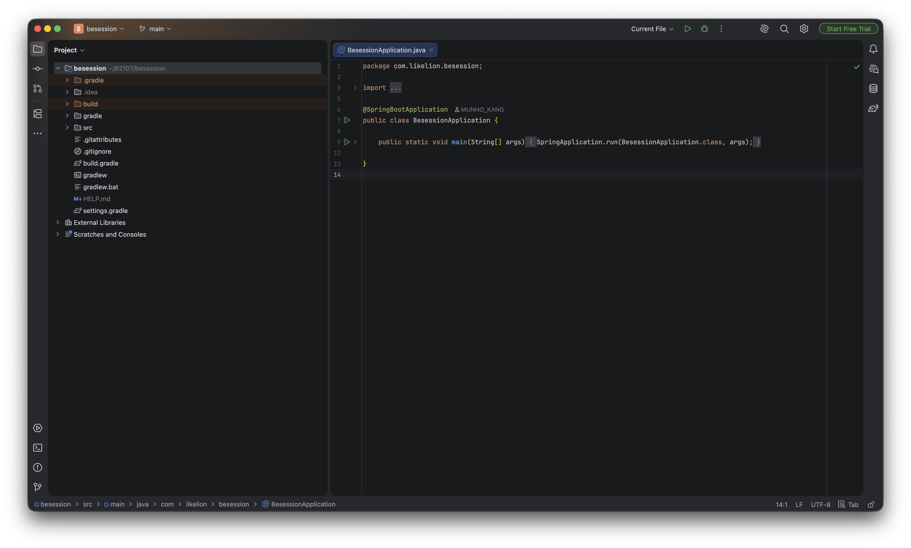

# 1회차 Java for Spring


# 📘 Today I Learned

### 1. 오늘 배운 내용
-IoC란????
Inversion of Control, 제어의 역전

-java spring boot 개념
Spring Initializr

### 2. 핵심 정리 (내 언어로)
-IoC == 제어의 역전

객체를 개발자가 직접 생성하는 것이 아니라 
객체가 필요할 때 Spring boot가 알아서 생성해줌


<pre>
```java
public class AnswerController {

    private final QuestionService questionService;
    private final AnswerService answerService;
    private final UserService userService;

    @PostMapping("/create/{id}")
    public String createAnswer(Model model, @PathVariable("id") Integer id, 
            @Valid AnswerForm answerForm, BindingResult bindingResult, Principal principal) {
        Question question = this.questionService.getQuestion(id);
        SiteUser siteUser = this.userService.getUser(principal.getName());
        if (bindingResult.hasErrors()) {
            model.addAttribute("question", question);
            return "question_detail";
        }
        this.answerService.create(question, answerForm.getContent(), siteUser);
        return String.format("redirect:/question/detail/%s", id);
    }
}
```
</pre>


<pre>
```2. 객체가 필요할 때(request가 들어와 무언가를 해야 할 때)

    @PostMapping("/create/{id}")

```
</pre>


<pre>
```1. 개발자는 객체를 생성하지 않고 파라미터로 받을 준비하기
```3. Spring boot가 생성해주는 객체 받기

    public String createAnswer(Model model, @PathVariable("id") Integer id, 
            @Valid AnswerForm answerForm, BindingResult bindingResult) 

```
</pre>


### 3. 실습 / 과제 / 결과물

<<<<<<< Updated upstream

=======

>>>>>>> Stashed changes


### 4. 느낀 점 & 다음 계획
1. IoC 개념에 대해서 제대로 알게 되었다.
2. Spring Initializr에서 설정할 때 각각 설정에 대해서 자세히 배우게 됨